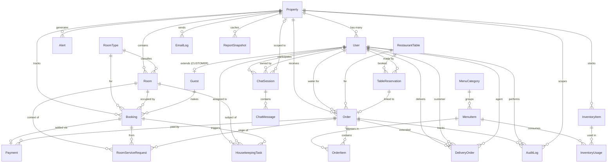

# IHG Platform — Data Model Documentation

> Comprehensive documentation of the database schema, relationships, multi-tenancy design, and data integrity rules.

---

## 📊 Entity-Relationship Diagram



---

## 🏛️ 22 Models, 6 Logical Groups

### 1️⃣ Auth & Multi-Tenancy (2 models)

| Model | Purpose | Key fields |
|---|---|---|
| **User** | All platform users (staff + customers) | `id, email, passwordHash, name, role, propertyId, isActive` |
| **Property** | Hotel/restaurant chain locations | `id, name, slug, address, city, country, currency, timezone` |

**Multi-tenancy pattern:** Every domain entity has `propertyId` foreign key. Queries always filter by `propertyId` to enforce isolation.

```typescript
// Example: every query scoped by property
const bookings = await db.booking.findMany({
  where: { propertyId: user.propertyId, status: "CONFIRMED" }
});
```

### 2️⃣ Hotel Module (5 models)

| Model | Purpose | Notable |
|---|---|---|
| **RoomType** | Defines categories (Standard, Deluxe, Suite) | `basePrice, capacity, amenities, imageUrl` |
| **Room** | Individual rooms | `roomNumber, floor, status: AVAILABLE/OCCUPIED/RESERVED/CLEANING/MAINTENANCE/DIRTY` |
| **Guest** | Customer profile (extends User) | `idType, idNumber, loyaltyPoints, vipStatus` |
| **Booking** | Room reservations | `bookingCode, checkInDate, checkOutDate, status, totalAmount` |
| **HousekeepingTask** | Cleaning/turndown tasks | `taskType, priority, status, assigneeId` |
| **RoomServiceRequest** | In-room requests | `category: FOOD/HOUSEKEEPING/AMENITIES/MAINTENANCE, status` |

**Status flow (Booking):**
```
PENDING → CONFIRMED → CHECKED_IN → CHECKED_OUT
            ↓
        CANCELLED / NO_SHOW
```

**Status flow (Room):**
```
AVAILABLE → RESERVED (booking created)
         → OCCUPIED (guest checks in)
         → DIRTY (guest checks out)
         → CLEANING (housekeeping in progress)
         → AVAILABLE (cleaned)
        or → MAINTENANCE (out of service)
```

### 3️⃣ Restaurant Module (4 models)

| Model | Purpose | Notable |
|---|---|---|
| **RestaurantTable** | Physical tables | `tableNumber, capacity, section, posX, posY, status` |
| **TableReservation** | Advance table bookings | `reservedAt, partySize, durationMins, status` |
| **MenuCategory** | Menu grouping (Appetizers, Mains...) | `displayOrder` |
| **MenuItem** | Dishes & drinks | `price, isVeg, prepTimeMins, isAvailable` |
| **Order** | Customer orders (all types) | `orderType: DINE_IN/DELIVERY/ROOM_SERVICE, status, subtotal, taxAmount` |
| **OrderItem** | Individual line items in order | `quantity, unitPrice (snapshot), notes, status` |

**Order status flow:**
```
PLACED → CONFIRMED → PREPARING → READY → SERVED → COMPLETED
                                      ↓
                              OUT_FOR_DELIVERY → DELIVERED → COMPLETED
                                          ↓
                                    CANCELLED (any state)
```

### 4️⃣ Delivery Module (1 model)

| Model | Purpose | Notable |
|---|---|---|
| **DeliveryOrder** | Extends Order with delivery info | `deliveryAddress, agentId, pickedUpAt, deliveredAt, deliveryFee, estimatedTime` |

**Relationship:** `DeliveryOrder.orderId` is `@unique` 1:1 with `Order` where `Order.orderType = "DELIVERY"`.

### 5️⃣ Shared Operations (3 models)

| Model | Purpose | Notable |
|---|---|---|
| **InventoryItem** | Stock/supply tracking | `name, sku, unit, quantity, minQuantity, unitCost, category` |
| **InventoryUsage** | Menu-to-inventory consumption | Links `MenuItem` to `InventoryItem` with quantityPerUnit |
| **Payment** | All financial transactions | `amount, currency, method: CASH/CARD/BKASH/NAGAD, status, transactionId` |

### 6️⃣ System & Observability (5 models)

| Model | Purpose | Retention |
|---|---|---|
| **Alert** | Real-time notifications (in-app) | Ephemeral, 90 days typical |
| **EmailLog** | All emails sent (mock or real) | Permanent audit |
| **AuditLog** | Who did what when | Permanent audit |
| **ReportSnapshot** | Cached analytics | Daily snapshots |
| **ChatSession** + **ChatMessage** | AI assistant conversations | 30 days typical |

---

## 🔐 Multi-Tenancy Architecture

### How isolation works

```sql
-- Every domain query MUST include propertyId
SELECT * FROM Booking WHERE propertyId = ? AND status = ?;

-- This applies to:
-- Booking, Room, Order, OrderItem, Payment,
-- HousekeepingTask, RoomServiceRequest, RestaurantTable,
-- MenuCategory, MenuItem, InventoryItem, Alert, etc.
```

### Role-based property access

| Role | Property access |
|---|---|
| `SUPER_ADMIN` | None assigned — sees all properties |
| `PROPERTY_ADMIN` | One assigned property |
| `MANAGER` / `RECEPTION` / etc. | One assigned property |
| `CUSTOMER` | Optional (for in-house tracking) |

### Property-scoped vs cross-property queries

**Property-scoped (most operations):**
- All booking, order, room operations
- All inventory, payment, alert operations
- Implemented in server actions: `requirePropertyUser()` ensures non-null propertyId

**Cross-property (admin only):**
- Property list
- User management
- Cross-property reports

---

## 🔗 Key Relationships

### 1. Booking ↔ Room (Many-to-One with auto-assignment)

```
RoomType (1) ──< (N) Room (1) ──< (N) Booking
                                          │
                                          └── Optional: roomId (set on check-in)
```

**Auto-assignment algorithm** (in `createBookingAction`):
1. Find requested RoomType
2. Query all rooms of that type
3. For each room, check date conflicts
4. Assign first conflict-free room

### 2. Order polymorphism (3 order types share one table)

```
Order.orderType: DINE_IN | DELIVERY | ROOM_SERVICE
        │
        ├── DINE_IN:      Order → RestaurantTable (tableId)
        ├── DELIVERY:     Order → DeliveryOrder (1:1)
        └── ROOM_SERVICE: Order → RoomServiceRequest (1:1)
```

This keeps the order lifecycle unified while allowing type-specific extensions.

### 3. Chat ↔ Property (flexible scoping)

```
ChatSession.propertyId = null  → Anonymous visitor, no property context
ChatSession.propertyId = X     → First active property (for public site visitors)
ChatSession.propertyId = X     → Logged-in user's property (for staff)
```

### 4. Soft delete via status fields

Instead of deleting records, we use status flags:
- `Booking.status = "CANCELLED"`
- `Order.status = "CANCELLED"`
- `Room.status = "MAINTENANCE"`
- `User.isActive = false`

This preserves audit trail integrity.

---

## 📇 Indexing Strategy

Critical indexes for query performance:

```prisma
// Multi-tenant filtering
@@index([propertyId])

// Status filtering (most common query)
@@index([status])

// Date range queries
@@index([checkInDate])
@@index([placedAt])
@@index([createdAt])

// Lookup by foreign key
@@index([userId])
@@index([menuItemId])

// Composite indexes for common query patterns
@@unique([propertyId, roomNumber])  // Room number unique per property
@@unique([propertyId, tableNumber]) // Table number unique per property
@@unique([orderNumber])             // Globally unique order numbers
@@unique([bookingCode])             // Globally unique booking codes
```

---

## 🛡️ Data Integrity Rules

### Constraints (enforced at app level)

1. **Booking total** = `nights × basePrice + tax - discount`
2. **Order total** = `sum(items[].unitPrice × quantity) + tax - discount`
3. **Booking dates** — `checkOut > checkIn`
4. **Order items** — quantity > 0
5. **Payment amount** — must match invoice (or partial with reason)

### Cascading deletes

```prisma
// Property deleted → all related data deleted (cascade)
Property → User (SetNull)        // Users unassigned, not deleted
Property → Room (Cascade)         // All rooms removed
Property → Booking (Cascade)      // All bookings removed
Property → Order (Cascade)       // All orders removed

// User deleted → user-specific data preserved, links cleared
User → Guest (Cascade)            // Guest profile removed
User → Order (SetNull waiter)     // Orders kept, waiter unassigned
```

### Audit trail

All critical operations log to `AuditLog`:
- `booking.create`, `booking.checkin`, `booking.checkout`, `booking.cancel`
- `order.create`, `order.update`, `order.cancel`
- `payment.create`, `payment.refund`
- `user.create`, `user.update`

Stored: `userId, action, entityType, entityId, metadata (JSON), ipAddress, userAgent, createdAt`.

---

## 🔄 Data Lifecycle Examples

### Example 1: Hotel booking end-to-end

```
1. User creates booking
   → Booking { status: "CONFIRMED", roomId: null }
   → Alert { type: "BOOKING_NEW", severity: "INFO" }
   → Email sent: booking confirmation
   → AuditLog { action: "booking.create" }

2. Reception checks in
   → Booking { status: "CHECKED_IN", actualCheckIn: now, roomId: assigned }
   → Room { status: "OCCUPIED" }
   → Alert { type: "BOOKING_CHECKIN" }
   → AuditLog { action: "booking.checkin" }

3. Housekeeping during stay
   → HousekeepingTask { taskType: "STAY_OVER", assigneeId: staff }
   → Task → status: "IN_PROGRESS" → "COMPLETED"

4. Reception checks out
   → Booking { status: "CHECKED_OUT", actualCheckOut: now }
   → Room { status: "DIRTY" }
   → HousekeepingTask { taskType: "CHECKOUT_CLEAN" }  // auto-created
   → Alert { type: "BOOKING_CHECKOUT" }
   → AuditLog { action: "booking.checkout" }

5. Housekeeping completes cleaning
   → HousekeepingTask { status: "COMPLETED" }
   → Room { status: "AVAILABLE" }  // auto-promoted
```

### Example 2: Restaurant + Delivery order

```
1. Waiter takes dine-in order
   → Order { orderType: "DINE_IN", tableId, status: "PLACED" }
   → OrderItem[] { menuItem, quantity, unitPrice (snapshot) }
   → RestaurantTable { status: "OCCUPIED" }
   → Alert { type: "ORDER_PLACED" }

2. Kitchen marks preparing
   → Order { status: "PREPARING", preparedAt: now }
   → OrderItem { status: "PREPARING" }

3. Kitchen marks ready
   → Order { status: "READY" }
   → Alert { type: "ORDER_READY" }
   → Email sent: order ready (if customer email)

4. Waiter marks served
   → Order { status: "SERVED", servedAt: now }
   → RestaurantTable { status: "AVAILABLE" }  // when all orders complete

5. Customer pays
   → Payment { amount, method: "CASH", status: "COMPLETED" }
   → Order { paidAmount += payment, status: "COMPLETED" when paid in full }
```

---

## 📈 Scalability Considerations

### Current scale (designed for)

- **Properties:** 1–100 (multi-tenant isolated)
- **Users per property:** up to ~500
- **Concurrent orders:** ~50
- **Daily bookings:** ~500
- **Data volume per year:** ~5GB

### Future scaling paths (without rewrite)

1. **Read replicas** — Prisma supports read-only connections for reports
2. **Database sharding** — by `propertyId` for very large chains
3. **Caching layer** — Redis for menu, room availability
4. **Search** — Meilisearch / Elasticsearch for menu/hotel search
5. **Real-time** — Replace polling with WebSockets/SSE for kitchen display

### Why SQLite for dev, PostgreSQL for prod

| Concern | SQLite | PostgreSQL |
|---|---|---|
| Setup | Zero — file-based | Server required |
| Concurrency | Limited writes | Excellent |
| JSON fields | Text | Native JSONB |
| Full-text search | Basic | Advanced |
| Enums | Not supported (we use String + TypeScript) | Native support |
| Production-ready | Single-server only | Battle-tested at scale |

**Our schema works on both** because we use String fields with TypeScript constants for type safety. The schema.prisma has commented instructions for switching.

---

## 🧪 Testing the Data Model

The data model is exercised by:

1. **Unit tests** (26 tests in `tests/utils.test.ts`) — `nightsBetween`, `formatCurrency`, RBAC
2. **Integration** via seed data — 8 users, 28 rooms, 21 menu items, 5 alerts, 4 orders, 2 reservations, 15 inventory items, 2 payments
3. **Manual smoke tests** — All CRUD flows work end-to-end in the UI

```bash
# Reset and re-seed
npx prisma db push --force-reset --accept-data-loss
npm run db:seed
```

---

## 📚 Related Documentation

- [README.md](../README.md) — Project overview
- [USER_MANUAL.md](USER_MANUAL.md) — How staff use the system
- [DEPLOYMENT.md](DEPLOYMENT.md) — Production deployment
- [AI_USAGE.md](AI_USAGE.md) — How AI was used in development
- [prisma/schema.prisma](../prisma/schema.prisma) — Source schema

---

*Last updated: August 2026 · IHG Platform v1.0*
